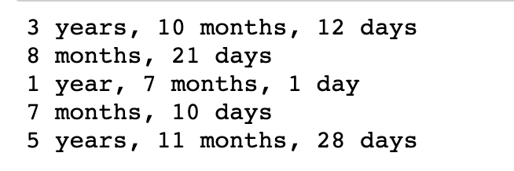
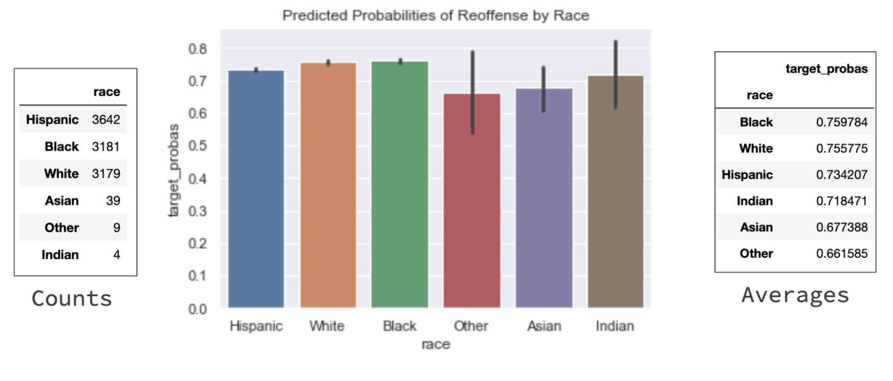

# Predicting Recidivism Rates
This work is designed to support entities offering services to formerly incarcerated individuals. The dataset consists of individuals currently incarcerated in the Texas Prison System.

### Problem Statement:
Is an inmate's initial crime and their age at the time it was committed predictive of recidivism?

### Goal:
To create a model that predicts the likelihood of recidivism for an inmate in an attempt to support the efforts of any entity providing services for previously incarcerated individuals.

### Contents
**In this Repository**

| Name | Link | Description |
| ---- | ---- | :---------- |
| Slides (8.27.19) | [Link](./Slides_Aug2019.pdf) | Process, Findings, Next Steps |
| Prep Notebooks | [Link](./Prep_Notebooks) |Creating Functions, Scraping, etc. |
| Notebook 1 | [Link](./NB1_Compiling_Datasets.ipynb) | Merging the datasets from the different scrapes |
| Notebook 2 | [Link](./NB2_Feature_Engineering.ipynb) | EDA, cleaning, feature engineering (getting data model ready) |
| Notebook 3 | [Link](./NB3_Modeling.ipynb) | Random Forest - fitting, confusion matrix, applying to test dataset |
| Notebook 4 | [Link](./NB4_Test_Visualizations.ipynb) | Test data visualizations |
| Datasets | [Link](./datasets) | Workflow from scrape, to cleaning, to feature engineering, to test set probability results. The [Propublica COMPAS datasets](https://www.propublica.org/datastore/dataset/compas-recidivism-risk-score-data-and-analysis) are also there for reference. |
| Images | [Link](./images) | images used in notebooks and README |
| Functions | [Link](./inmate_scrape.py) | The final functions used to scrape and save data from the [Texas Tribune Prison Main Page](https://www.texastribune.org/library/data/texas-prisons/) |

**Data Dictionaries**

Data Summary:
- `40,214` unique inmates incarcerated in a Texas prison as of 8-23-2019
- `101` of the 108 total Texas prison facilities represented
- each individual's current offense, and up to three additional priors
- basic inmate identification s/a: home county, DOB, race, sex, & age

 Scraping/Initial Datasets 

>  [Priors csv](./datasets/my_data/priors_FINAL.csv)

>  [Inmate Details csv](./datasets/my_data/inmate_details_FINAL.csv)

>  [Merged csv](./datasets/my_data/complete_raw_df.csv)

**Priors csv**

All inmates have a `pr_crime_0`, which is their current offense. Some inmates have additional priors, and these are identified as pr_crime_1, pr_crime_2, and pr_crime_3. If an inmate does not have any or all of these priors, these cells for that inmate are filled with `'No_data'`. Connected to each offense is `pr_commit_date`, `pr_term`, and `pr_begins`. Below each of these is listed only once. However, each inmate could have information in some or all of these. Pr_crime_3 is their oldest prior, whereas pr_crime_1 is their most recent. This information was scraped from the [Texas Tribune](https://www.texastribune.org/library/data/texas-prisons/units).

| Data | Type | Description |
| --- | --- | :--- |
| name | string | inmate's name |
| TDCJ_ID | int | unique identification number for each inmate |
| pr_crime_0 | string | current offense; `pr_crime_1`, `_2`, `_3` also present |
| pr_commit_date_0 | string | the date this offense was committed; `pr_commit_date_1`, `_2`, `_3` also present |
| pr_term_0 | string | the length of time of the sentence; `pr_term_1`, `_2`, `_3` also present |
| pr_begins_0 | string | the first day of the sentence; `pr_begins_1`, `_2`, `_3` also present  |

**Inmate Details csv**

This is the personal information of each inmate.

| Data | Type | Description |
| --- | --- | :--- |
| name | string | inmate's name |
| sex | string | 'Male', 'Female' |
| race | string | each inmate's race |
| age | int | current age |
| max_sentence | string | each inmate's maximum sentence|
| prison_unit | string | the prison they are located |
| DOB | string | each inmate's date of birth |
| home_county | string | each inmate's home county |
| TDCJ_ID | int | unique identification number for each inmate |
| proj_release_date | string | an inmate's projected release date |

 Model Ready Dataset 

>  [Model Ready Dataset](./datasets/my_data/complete_model_ready.csv)

**Model Ready Dataset**

This is the `cleaned dataset` with features ready to be trained. Steps that were taken are explained below in the `process section` of the README. These features have been added to the original dataset, and the descriptions below address added or altered features exclusively.

17 types of crimes were categorized and made into dummy variables. The remaining crimes were distributed in a category called `other_crime`. Only one is represented in the dictionary below. Details about the categories are discussed in the `process` section of the README. Additionally, `101 prisons` were represented in the final dataset, and dummy variables were created. The base variable name is used to represent all below. `Ages` and `terms` were converted to floats and binned to be able to check each within the model. For both, the floats were used as features.

| Data | Type | Description |
| --- | --- | :--- |
| feature_crime | string | the inmate's initial offense (up to three priors) |
| feature_startdate | datetime | when the sentence of the initial offense began |
| feature_term | string | the years, months, and days of the inmate's term |
| feature_commit_date | datetime | the date the offense was committed |
| target_value | mixed | if there is a re-offense, the crime itself; if no re-offense, the int 0|
| final_target | int | the y-value; ``{1: reoffend, 0: no re-offense}``|
| theft_crime | int | ``{1: theft related crime, 0: not}`` |
| prison_unit_ | int | ``{1: at this prison, 0: not}`` |
| commit_age | float | the age of each inmate at the time the feature crime occurred |
| feature_term_flt | float | the years, months, and days of each inmate's term in a numerical float |
| term_binned_ | int | ``{1: remaining term in that range, 0: not}``; in years: `Less than 1`, `1_to_5`, `11_15`, `16_20`, `21_30`, `31_40`, `40+` |
| age_binned_ | int | ``{1: age in that range, 0: not}``; `Under 18`, `18 to 30`, `31 to 40`, `41 to 50`, `51 to 60`, `61 to 70`, `Above 70` |

## Process Details:
### Step 1: Research
> What data do I want?

> What data is available?

> What can I actually obtain?

 Research Details 

I began this project by looking into available government datasets. I also found Probublica's work exposing racial bias in the COMPAS algorithm (kaggle and research/explanatory articles). This allowed me to gain access to their process,  their notebooks of work, and their datasets.

From here I considered what data I might want, and I started looking into the Huntsville State Penitentiary.

The Texas Tribune became the exclusive source of my data for this project. Through this website I learned I could access all prisons in the Texas System and each current inmate.

### Step 2: Data Collection
> Now that I found it, how in the world am I going to get it?

 Data Collection Details 

- Beautiful Soup
- Amazon Web Services

This part of the project took an extensive amount of time and offered a great deal of learning opportunity. Creating effective, efficient, and intentional functions to scrape the data needed was a days-long process of trial and error.

#### Highlights of learning:
- the invaluable nature of `try/except` statements
- automating `saving to a .csv` routinely within the function
  -- building out a shell of the notebook from a partial .csv while the scrape is running
- ensuring the same `unique identifier` for each observation is in all datasets intended to be merged (ie: names of individuals is not sufficient, a qualifying id or url tag is essential)
- the scrape can take days (and days and days)

#### Final Counts:
- `56,600` unique inmate basic detail observations
- `47,500` unique inmate prior detail observations
- merged dataset with `47,500 unique inmates`

#### Limitations of the Data:
- Only scraped the 4 most recent crimes, rather than all, so some inmates `feature_crime` was not their actual initial crime (this was a choice I made based on my limitations of time, it is absolutely possible to acquire all priors for each inmate).
- Only current inmates are represented in the dataset, this is missing individuals previously incarcerated that have not reoffended. These individuals would enhance the model.
- There are many types of facilities represented in the Texas Tribune database (`State Jail`, `Prison`, `Work Program`, `Transfer Facility`). The non-prison units are not filtered out of this dataset.
- No additional inmate information was acquired (ie: education, occupation, family information, etc).
- There were some (`very few`) errors found in the original data, and some questionable data that I could not conclusively confirm or disprove:
        - one inmate's DOB and and the date of their first offense is the same
        - some term lengths were invalid (`'2012 years, 8 months, 16 days'`)
        - the minimum age for first offense was 11 years old - I was unable to confirm if this is accurate, but it opened the door for the potential of incorrectly imputed information in the original dataset

### Step 3: Cleaning, Feature Engineering, & EDA
> What do I need?

> What can I actually do?

> How can I make this happen?

 Cleaning, Feature Engineering, & EDA Details 

Almost all of the data had to be manipulated or converted from its original form in order to explore or be used to model. These are some of the highlights.

#### Term Lengths:
This was a new challenge for me, because it was the first time there was inconsistency in the structure of the strings.
This is a sample of what some of the unique terms, as strings, were:

**Goal:** To convert these terms to accurate floats.
**Steps to solving this problem:**
1. Remove observations with clear errors, such as `'2012 years, 8 months', 16 days`
> There were two of these instances discovered

2. Remove observations including `'Life'`, `'Life Without Parole'`, `'Death'`
3. Creating a list of the remaining terms (`40,214` observations remaining) that are `split on the comma`
4. `Indexing` into the terms, removing the letters and spaces, adding periods in the appropriate space to set up the float, and `converting each to a float`.
5. Dividing any number associated with months by 12 and any number associated with days by 365.
6. Adding the corrected months and days to the years in index[0].
7. Creating a new list consisting of only index[0].
8. `df['feature_term_flt'] = new_list`

#### Crime Categories:
**Goal**: With `9005 unique feature crimes`, it felt important to create meaningful and categories to utilize as features.
**Steps to solving the problem:**
1. Visual search for common words
2. Create functions to apply/make new feature columns {`1: this category, 0: not`}
3. Create `other_crime` category by adding all of the category columns together. If != 0, replace with 0. If 0 (meaning no other categories are flagged), replace with 1.
4. Check crimes in other_crime category to add to current categories or create new ones.

### Step 4: Modeling
> Model Selection

> Best Parameters

> Results

 Modeling 

I tried modeling SVC, Random Forest, and Logistic Regression. SVC and Random Forest were chosen based on research about modeling imbalanced classes. Logistic Regression was chosen for the opportunity to interpret coefficients. The highest training score of the three was `Random Forest`.

**Random Forest Details**
- `Best accuracy score: .775`
- `Best params: {max_depth= 10,
               min_samples_leaf= 1,
               min_samples_split=4,
               N_estimators=150}`
- `Precision: {0: .65, 1: .79}`
- `Recall: {0: .25, 1: .95}`

A single decision tree in the random forest (modified `max_depth = 4` for visual accessibility):
         

### Step 5: Findings & Applications
> Model Selection

> Best Parameters

> Results

 Findings & Applications 

1. **Probability Range from `.12 to .98`**

2. **Probabilities of reoffense based on inmate race**

3. **Practical application:**
- Filter by location of interest (ie - `prison unit`)
- Filter by probability range of interest (ie - `.30 - .70`)
- Filter by projected release date (ie `1 year from today`)

### Step 5: Opportunities for Improvement
> How to make the model better

 Opportunities for Improvement 

 I think it might improve the model to collect all priors for each inmate, rather than only going back to the most recent three. Even if the scores did not improve, it would still be an improved/more complete dataset this way.

The accuracy score for Random Forest was .775, and the recall score for predicting the 0 class (non-reoffenders) was only .29. I think expanding the feature engineering, and potentially collected data that has a stronger correlation might improve the model's prediction of non-reoffenders. I hit roadblocks in determining what, specifically, that data would be, and then if/how I would be able to capture it.

While there is currently some signal, the overall accuracy score is only 3% higher than if the model were to exclusively predict reoffense. There is certainly room for improvement with the model.
